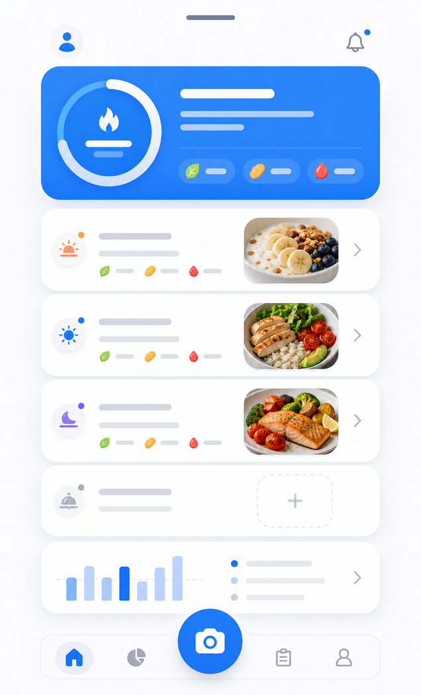
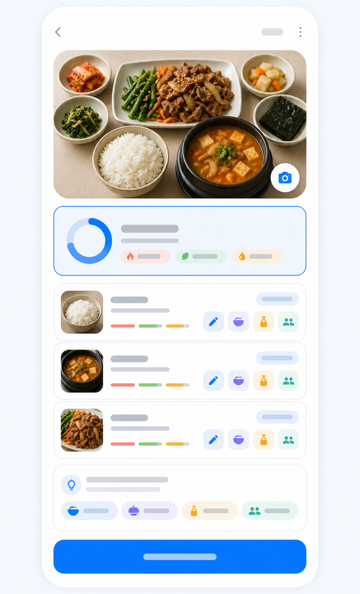

# 칼로그 (callog) — 식단 칼로리 AI 분석 (앱인토스 미니앱)

사진 한 장으로 식사 칼로리·영양을 분석하는 [앱인토스](https://toss.im) 미니앱. 광고 기반 무료, 토스 3천만 유저 대상.

> 코드는 비공개(상용 앱). 이 저장소는 프로젝트 설명·스크린샷입니다.

  
  

## 핵심
- **사진 → AI 칼로리 분석** — 멀티모달 LLM(vision)로 음식 인식·칼로리/영양 추정. 음식별 위치 라벨링(grounding으로 정확도↑)
- **정확도 엔진** — CalorieCLIP 앙상블(비용0 정확도 +10%p) + 기준물체 캘리브레이션 프롬프트. Nutrition5k 벤치로 MAPE 46→35% 개선
- **수익·비용 설계** — 분석당 전면광고로 AI 비용 충당, 전역 rate limit·OpenAI 지출캡으로 폭주 방어. 건강 미션 포인트(토스 비즈월렛 예산캡)
- **서버리스 백엔드** — Vercel serverless + Supabase, 식약처 영양 DB 28만 건

## 기술
React 19 · Vite · 앱인토스(Granite) · Vercel serverless · Supabase Postgres · OpenAI vision · Railway(CalorieCLIP 워커)

## 상태
출시·운영 중. 토스 바이브코딩 챌린지 제출작
